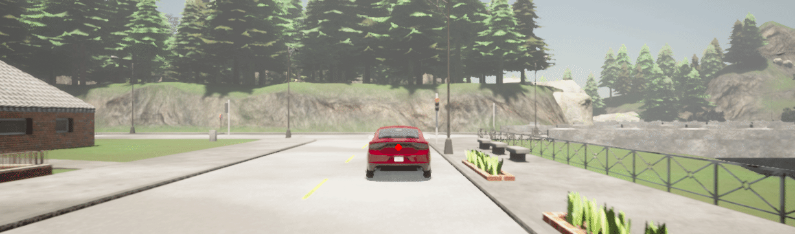

# PEM Rare-Event Sampling in CARLA

Code for paper: [Testing Rare Downstream Safety Violations via Upstream Adaptive Sampling of Perception Error Models](https://arxiv.org/abs/2209.09674).

This code base runs a cross-entropy-based adaptive importance sampling algorithm for an automated braking scenario. In this scenario, the ego vehicle is following another vehicle on a straight road, until the car in front brakes at a red light. The ego vehicle must brake to avoid crashing. The ego vehicle uses a Perception Error Model as a surrogate for a YOLO-based obstacle detector trained on the [KITTI dataset](https://www.cvlibs.net/datasets/kitti/). The safety specification for avoiding a crash is written in signal temporal logic:

$$\square_{[0, T]} x$$

It simulates automated braking scenario where a car is following another one in front, and then the other car brakes at red light, we must brake to avoid crashing. Uses obstacle detector based on the yolo architecture trained on the kitti dataset (picture below?). Safety specification is written in STL (see the code for this), with 

Description of what the heck this thing is here

## Setup

### Installation

- Install and run the CARLA simulator. Instructions [here](https://carla.readthedocs.io/en/latest/start_quickstart/)
- Install python package pre-requisites using `python -m pip install -r requirements.txt`

### Pre-trained models

A pre-trained version of the Perception Error Model used for the automated braking experiments (listed as `ML-NN` in the paper). Can be found under `models/det_baseline_full/pem_class_train_full`, and can be used as the `pem` argument in the experiment runner scripts.

If you want to train the PEMs from scratch, you will first need a [YOLO Obstacle Detector](https://pjreddie.com/darknet/yolo/) trained on the [KITTI dataset](https://www.cvlibs.net/datasets/kitti/). For example, a pre-trained py-torch version can be found [here](https://github.com/packyan/PyTorch-YOLOv3-kitti).

For the alternative baseline PEMs found in the paper, the logistic-regression PEM (`LR`) was trained using [sci-kit-learn](https://scikit-learn.org/stable/modules/generated/sklearn.linear_model.LogisticRegression.html), and the Bayesian Neural Network (`B-NN`) was trained using [pyro](http://pyro.ai/).

## How to Run

### Running Simulations

To run the adaptive importance sampling experiment for the automated braking scenario from the paper, run the command:

`runSim.py <n-stages> <n-sims> <timesteps> <pem> <metric> <exp-name>`

Here are a description of the arguments:

- __n-stages__: The number of adaptive simulation stages to run in cross-entropy importance sampling. Corresponds to the $K$ parameter in paper.
- __n-sims__: The number of simulation rollouts sampled per adaptive stage. Corresponds to $N_{\kappa}$ parameter in paper.
- __timesteps__: Time steps per simulation episode. Parameter $T$ in paper.
- __pem__: Path to pre-trained perception error model. Try `models/det_baseline_full/pem_class_train_full`
- __metric__: STL Robustness metric used for evaluation. Choices are `["classic", "agm", "smooth-cumulative"]`
- __exp-name__: Name given to experiment. Simulation rollout logs will be saved to `sim_data/{exp-name}-{metric}-K{n-stages}-e{n-sims}-t{timesteps}/<current-timestamp>`, and learned proposal samplers will be saved to `models/CEMs/{exp-name}-{metric}-K{n-stages}-e{n-sims}-t{timesteps}/<current-timestamp>`
- __render__: True/False flag of whether to render simulations or not.

If run with render=True, then you should see the following:

#### Server window

#### On-board camera output

### Analysing Data

To see a plot of a given proposal distribution, run: 

`vizDistanceProposal.py <cem-model-path>`

This charts the current distance from the car in front to the detection rate the proposal model gives for states with that distance.

To chart the number of failures, and average negative log-likelihood of a given set of simulation rollouts, run:

`analyzeFailures.py <rollout-folder-path> <pem-path> <metric>`

